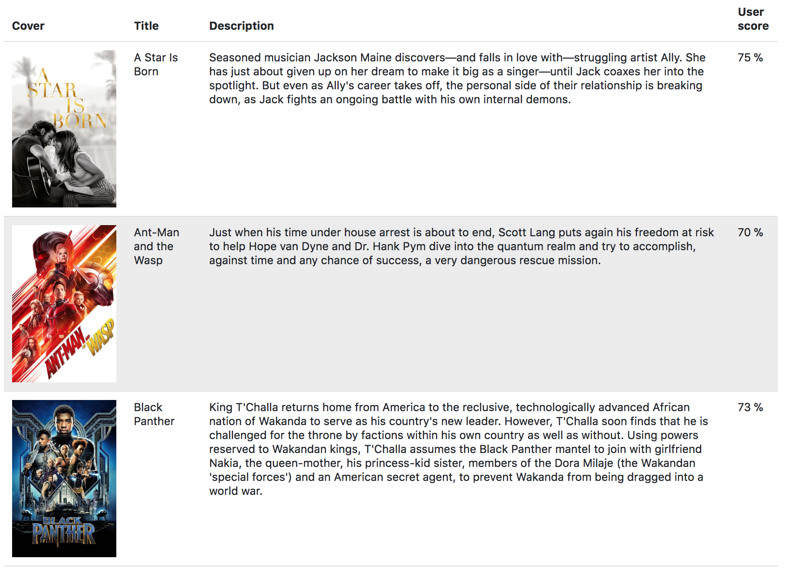

# DevOps Engineer - Technical Test - FoxIntelligence

This is my response to the technical test to apply for a *DevOps Engineer* role at *Foxintelligence* https://foxintelligence.fr/jobs.html

# Requirements

An AWS account able to instanciate EC2 instances and create a security group for those instances.
[Ansible](https://docs.ansible.com/ansible/latest/installation_guide/intro_installation.html) and [terraform](https://www.terraform.io/downloads.html) available on the local machine

# Configuration

## Environment variables to provide

### General

| Variable                              | Description    | Default         |
| ------------------------------------ | --------------- | ----------------|      
| AWS_REGION                     | Needed for terraform and backend | us-east-1
| AWS_ACCESS_KEY_ID                     | Needed for terraform and backend | 
| AWS_SECRET_ACCESS_KEY | Needed for terraform and backend | 
| TF_VAR_KEYNAME | Your .pem key used to connect through SSH to instances
| TF_VAR_WORKERS | Number of docker workers with the manager | 3 |

### Backend

| Variable                              | Description             | Default                            |
| ------------------------------------ | ---------------        | --------------------------------- |
| AWS_REGION | AWS region | eu-central-1 |
| S3_BUCKET | S3 bucket | devops-test-foxintelligence |
| MONGO_URI | MongoDB URI | mongodb:27017 |
| PORT | Server port | 8080 |

### Frontend

| Variable                              | Description             | Default                            |
| :------------------------------------ | :---------------        | :--------------------------------- |
| PORT                     | Server port | 3000 |
| BACKEND_URL                     | Backend url | http://localhost:8080 |

## Usage

```shell
terraform init
export TF_VAR_IPADDR=$(curl ipecho.net/plain; echo)
terraform plan 
terraform apply (insert yes when asked)
cd Ansible
ansible-playbook install.yml
````

- Get the first IP address from Ansible/inventories/inv.ini
- Point your browser to http://IP:3000 you should see the following dashboard:



When you've finished testing : 
```shell
cd ..
terraform destroy (insert yes when asked)
```
## Bonus Done

- Documented all aspects of my code, in the README and within the code itself.
- After running Terraform, all runs in one playbook
- A draft of a CD pipeline can be run by launching ```ansible-playbook deploy.yml ```
- You can create a number of workers by setting the *TF_VAR_WORKERS* env variable. You can only do that at the creation of the Swarm.


## Difficulties :
* Join Swarm as Worker, had to pass entrance ports into Security Group (Terraform) from Everywhere, couldn't use just security group.
* Docker installation : Had to install an old version, else it didn't work on the EC2 instances.

    - Couldn't insert endpoint_mode in deploy section to the docker-compose, as it needed version 3.3, which was not supported by docker engine v17.03.3 but 17.06.0+
    - Installing this old version couldn't be used calling the yum ansible module. Had to call shell calling yum


